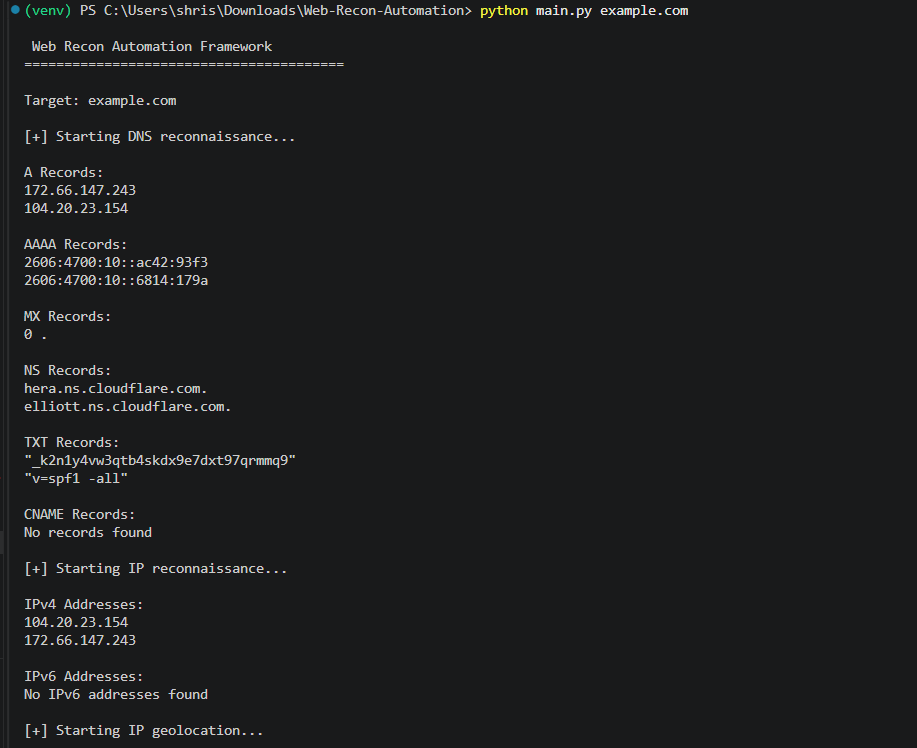
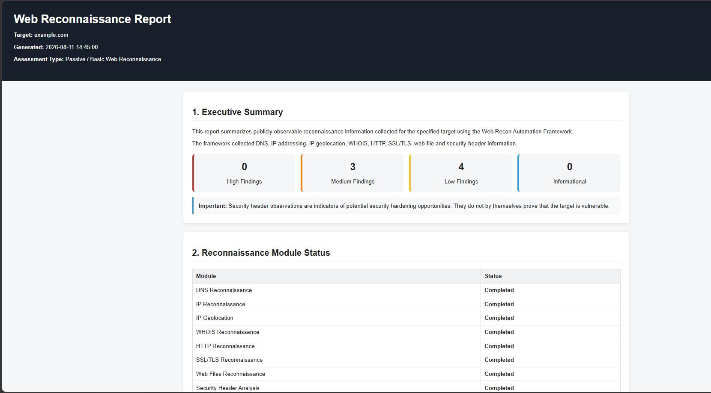
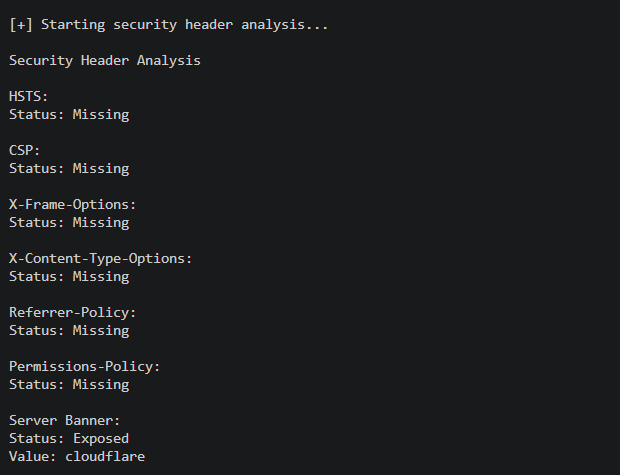

# Web Recon Automation Framework

A modular Python-based reconnaissance framework that automates the collection of publicly available information about an authorized web target and generates a structured HTML reconnaissance report.

The project demonstrates practical cybersecurity automation, modular Python development, reconnaissance techniques, error handling, logging, testing, and security reporting.

---

## 🎯 Project Objective

During a penetration testing or security assessment, reconnaissance can involve repeatedly using multiple tools to collect information about a target.

This project automates that initial reconnaissance process through a single command-line interface.

The framework accepts a domain or URL and collects:

- DNS records
- IPv4 and IPv6 addresses
- IP geolocation
- WHOIS information
- HTTP response information
- HTTP security headers
- SSL/TLS certificate information
- `robots.txt`
- `sitemap.xml`
- Basic security observations

The collected information is then compiled into a structured HTML report.

---

## ✨ Project Highlights

- 🔍 Automated DNS reconnaissance
- 🌐 IPv4 and IPv6 address discovery
- 📍 IP geolocation with ISP, organization, and ASN details
- 🏷️ WHOIS domain information gathering
- 🌐 HTTP response and header analysis
- 🔐 SSL/TLS certificate analysis
- 🤖 `robots.txt` and `sitemap.xml` discovery
- 🛡️ Security header analysis
- 📊 Automated HTML reconnaissance report generation
- 📝 Structured logging
- 🧪 Automated unit testing with pytest
- ⚙️ Modular Python-based architecture
- ❌ Graceful handling of invalid or unreachable targets
- 🖥️ Cross-platform setup instructions
- 📁 Custom report output path
- 🔎 Verbose logging option

---

## 🏗️ Architecture

The framework follows a modular architecture where each reconnaissance task is handled by a separate module.

```text
                    Target Domain / URL
                           │
                           ▼
                  ┌─────────────────┐
                  │ Target Validator│
                  └────────┬────────┘
                           │
                           ▼
              ┌─────────────────────────┐
              │   Reconnaissance        │
              │       Modules           │
              └────────────┬────────────┘
                           │
       ┌───────────────────┼───────────────────┐
       │                   │                   │
       ▼                   ▼                   ▼
    DNS / IP             WHOIS             HTTP / SSL
       │                   │                   │
       └───────────────────┼───────────────────┘
                           │
                           ▼
                  Web Files Analysis
                           │
                           ▼
                Security Header Analysis
                           │
                           ▼
                    Data Aggregation
                           │
                           ▼
                 HTML Report Generator
                           │
                           ▼
                  Reconnaissance Report
```

---

## 📦 Module Structure

| Module | Responsibility |
|---|---|
| `core/validator.py` | Validates and normalizes the target |
| `modules/dns_recon.py` | Collects DNS records |
| `modules/ip_recon.py` | Discovers IPv4/IPv6 addresses |
| `modules/geolocation_recon.py` | Retrieves IP geolocation information |
| `modules/whois_recon.py` | Collects WHOIS information |
| `modules/http_recon.py` | Analyzes HTTP responses and headers |
| `modules/ssl_recon.py` | Collects SSL/TLS certificate information |
| `modules/web_files_recon.py` | Checks `robots.txt` and `sitemap.xml` |
| `modules/security_headers.py` | Checks important security headers |
| `modules/report_generator.py` | Generates the final HTML report |

---

# 🚀 Installation

## Prerequisites

Make sure Python 3.x and Git are installed.

Check Python:

```bash
python --version
```

Check Git:

```bash
git --version
```

---

## 1. Clone the Repository

```bash
git clone https://github.com/vk18-tech/Web-Recon-Automation.git
cd Web-Recon-Automation
```

---

## 2. Create a Virtual Environment

### Windows PowerShell

```powershell
python -m venv venv
```

### Windows Command Prompt

```cmd
python -m venv venv
```

### Linux / macOS

```bash
python3 -m venv venv
```

---

## 3. Activate the Virtual Environment

### Windows PowerShell

```powershell
.\venv\Scripts\Activate.ps1
```

### Windows Command Prompt

```cmd
venv\Scripts\activate
```

### Linux / macOS

```bash
source venv/bin/activate
```

After activation, your terminal should display:

```text
(venv)
```

---

## 4. Install Dependencies

The project dependencies are defined in `requirements.txt`.

```bash
pip install -r requirements.txt
```

---

# ▶️ Usage

The framework requires an authorized domain or URL.

Basic usage:

```bash
python main.py example.com
```

The framework performs:

```text
DNS reconnaissance
        ↓
IP reconnaissance
        ↓
IP geolocation
        ↓
WHOIS reconnaissance
        ↓
HTTP reconnaissance
        ↓
SSL/TLS reconnaissance
        ↓
Web files reconnaissance
        ↓
Security header analysis
        ↓
HTML report generation
```

---

## 🔎 Command-Line Options

### Display Help

```bash
python main.py --help
```

Available options include:

```text
usage: main.py [-h] [--verbose] [--output OUTPUT] target

Automated web reconnaissance and HTML reporting framework.

positional arguments:
  target           Target domain or URL

options:
  -h, --help       show this help message and exit
  --verbose        Display detailed logging information during reconnaissance
  --output OUTPUT  Custom path for the generated HTML report
```

---

## 📝 Verbose Mode

Use `--verbose` to enable detailed logging during reconnaissance.

```bash
python main.py example.com --verbose
```

This is useful when troubleshooting or monitoring reconnaissance activity.

---

## 📄 Custom Report Location

By default, the framework generates the report inside the `reports/` directory.

```bash
python main.py example.com
```

Default output:

```text
reports/recon_report_example.com.html
```

A custom output path can be specified using `--output`:

```bash
python main.py example.com --output reports/test_report.html
```

The report will then be generated at:

```text
reports/test_report.html
```

---

# 🔎 Features

## DNS Reconnaissance

Collects:

- A records
- AAAA records
- MX records
- NS records
- TXT records
- CNAME records

---

## IP Reconnaissance

Identifies:

- IPv4 addresses
- IPv6 addresses

---

## IP Geolocation

Collects basic publicly available information associated with discovered IP addresses:

- Country
- Region
- City
- Postal code
- Latitude
- Longitude
- ISP
- Organization
- ASN

IP geolocation results are approximate and should not be interpreted as the exact physical location of a system.

---

## WHOIS Reconnaissance

Collects available domain registration information such as:

- Registrar
- Creation date
- Expiration date
- Updated date
- Name servers
- Domain status

WHOIS availability depends on the target domain and WHOIS server.

---

## HTTP Reconnaissance

Collects:

- HTTP status code
- Response time
- Server information
- Content type
- HTTP response headers

---

## SSL/TLS Reconnaissance

Collects:

- TLS version
- Certificate subject
- Certificate issuer
- Certificate validity period
- Days remaining

---

## Web Files Reconnaissance

Checks for:

- `robots.txt`
- `sitemap.xml`

The framework records whether these resources are available and captures their content when accessible.

---

## Security Header Analysis

Checks for commonly used security headers:

- Strict-Transport-Security
- Content-Security-Policy
- X-Frame-Options
- X-Content-Type-Options
- Referrer-Policy
- Permissions-Policy

It also checks whether the HTTP `Server` banner is exposed.

### Important

A missing security header or exposed server banner is an **observation** and does not automatically confirm a vulnerability.

---

# 🧪 Testing

The project includes automated tests using `pytest`.

Run the test suite:

```bash
pytest
```

Current test coverage includes:

- Target validation
- DNS reconnaissance
- Security header analysis

Example:

```text
============================= test session starts =============================

collected 11 items

tests/test_dns_recon.py ...
tests/test_security_headers.py .....
tests/test_validator.py ...

============================== 11 passed ==============================
```

---

# 📝 Logging

The framework records important events and errors in:

```text
logs/recon.log
```

The logging system records events such as:

- Target validation
- Reconnaissance module execution
- Errors
- Report generation

The `logs/` directory is excluded from Git using `.gitignore`.

---

# 📊 Sample Report

A sample reconnaissance report generated by the framework is included in the repository.

**Target:** `example.com`

The report contains:

- DNS records
- IPv4 and IPv6 addresses
- IP geolocation
- WHOIS information
- HTTP response details
- HTTP security headers
- SSL/TLS certificate information
- `robots.txt` and `sitemap.xml` results
- Security observations

👉 [View the Sample HTML Report](reports/recon_report_example.com.html)

---

# 🛠️ Technology Stack

- **Language:** Python 3
- **DNS & Network Recon:** `dnspython`
- **WHOIS:** `python-whois`
- **HTTP Analysis:** `requests`
- **SSL/TLS:** Python `ssl` module
- **IP Geolocation:** IP geolocation API
- **Report Generation:** Python / HTML
- **Logging:** Python `logging`
- **Testing:** `pytest`
- **Version Control:** Git & GitHub

---

# 📁 Project Structure

```text
Web-Recon-Automation/
│
├── core/
│   ├── __init__.py
│   ├── logger.py
│   └── validator.py
│
├── modules/
│   ├── __init__.py
│   ├── dns_recon.py
│   ├── ip_recon.py
│   ├── geolocation_recon.py
│   ├── whois_recon.py
│   ├── http_recon.py
│   ├── ssl_recon.py
│   ├── web_files_recon.py
│   ├── security_headers.py
│   └── report_generator.py
│
├── tests/
│   ├── test_dns_recon.py
│   ├── test_security_headers.py
│   └── test_validator.py
│
├── reports/
│   └── recon_report_example.com.html
│
├── screenshots/
│   ├── 01_framework_execution.png
│   ├── 02_html_report.png
│   └── 03_security_headers.png
│
├── logs/
│   └── recon.log
│
├── main.py
├── requirements.txt
├── pytest.ini
├── README.md
├── LICENSE
└── .gitignore
```

---

# 📸 Screenshots

## Framework Execution



## Generated HTML Report



## Security Header Analysis



---

# ⚠️ Limitations

- Results depend on DNS, WHOIS, geolocation, and target-server availability.
- Some WHOIS servers may restrict automated queries.
- IP geolocation provides approximate information and should not be treated as an exact physical location.
- Security header findings indicate missing or exposed headers; they do not by themselves confirm a vulnerability.
- `robots.txt` and `sitemap.xml` may not exist on every website.
- Some HTTP or SSL/TLS information may be unavailable when a target is unreachable.
- The framework performs passive/basic reconnaissance and does not perform exploitation or intrusive vulnerability scanning.
- The framework depends on third-party services and libraries for some reconnaissance functions.

---

# 🔐 Responsible Use

This framework is intended for:

- Authorized security testing
- Cybersecurity education
- Security research
- Reconnaissance of systems you own
- Assessments where explicit permission has been granted

Only run this tool against domains and systems that you own or have explicit authorization to assess.

The project does not perform exploitation or unauthorized access.

---

# 👩‍💻 Author

**Shrishti Pandey**

B.Tech Computer Science Student | Cybersecurity Enthusiast | SOC Analyst Aspirant

---

# 📄 License

This project is licensed under the MIT License.

See the [LICENSE](LICENSE) file for details.